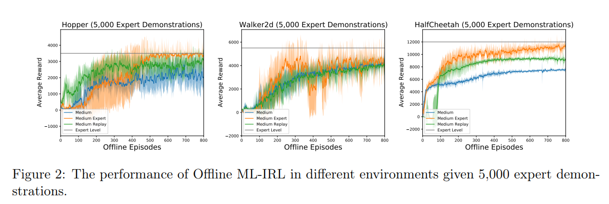
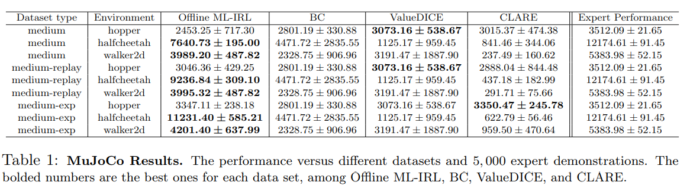

# Understanding Expertise through Demonstrations:A Maximum Likelihood Framework for Offline Inverse Reinforcement Learning
ML-MBIRL is an algorithm for offline inverse reinforcement learning that is discussed in the article [arxiv link](http://arxiv.org/abs/2302.07457)

## Figures

## Installation
- PyTorch 1.13.1
- [MuJoCo210](https://www.roboti.us/license.html)
- pip install -r requirements.txt


## File Structure
- Experiment result ：`data/`
- Configurations: `args_yml/`
- Expert Demonstrations: `expert_data/`

## Instructions
- All the experiments are to be run under the root folder. 
- After running, you will see the training logs in `data/` folder.

## Experiments
All the commands below are also provided in `run.sh`.

### Sec 1 Offline-IRL benchmark (MuJoCo)
Before experiment, you can download our expert demonstrations here and our trained world model [to do](http://arxiv.org/abs/2302.07457).

```bash
python train.py --yaml_file args_yml/model_base_IRL/halfcheetah_v2_medium.yml --seed 0 --uuid halfcheetah_result 
```

### Sec 2 Transfer task
First, you can generate expert data by training expert policy:
Make sure that the `env_name` parameter in `configs/samples/experts/ant_transfer.yml` is set to `CustomAnt-v0`
```bash
python common/train_gd.py configs/samples/experts/ant_transfer.yml
python common/collect.py configs/samples/experts/ant_transfer.yml
```

After the training is done, you can choose one of the saved reward model to train a policy from scratch (Recovering the Stationary Reward Function).

Transferring the reward to disabled Ant

```bash 
python common/train_optimal.py configs/samples/experts/ant_transfer.yml
python ml/irl_samples.py configs/samples/agents/data_transfer.yml(data transfer)
```

## Performances


-----



----
